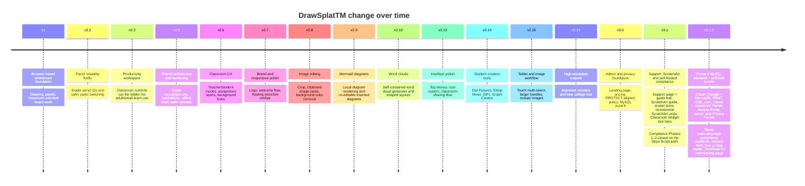

# DrawSplatTM

DrawSplatTM is a self-contained interactive whiteboard for K-16 educators and students. It runs as a static website, works in the browser, and can optionally save boards, templates, collaboration rooms, and turn-ins to Google Drive and Google Sheets — or to your own MySQL-backed server.

**Free for everyone.** Software, all backends, all compliance features. Districts that want paid setup, professional learning, or compliance review can engage that as a separate service — see [pricing](pages/pricing.html). If DrawSplatTM saved you a planning period, [buy the developer a cup of coffee](https://buymeacoffee.com/drawsplat).

- **Official site:** [https://drawsplat.org](https://drawsplat.org)
- **Open the whiteboard:** [drawsplat.org/app/whiteboard.html](https://drawsplat.org/app/whiteboard.html)
- **Source:** this repository (AGPL-3.0-or-later)
- **Status:** v3.1, Compliance Phases 1–3 complete on the Apps Script path, Phase 4 (MySQL) scaffolded end-to-end (OAuth, RBAC, SSE, cron, Clever connector, parent portal, privacy packet, migration CLI)
- **Self-host bundle:** [`pages/download.html`](pages/download.html) explains the three deployment paths; `./scripts/make-selfhost-bundle.sh` produces a curated zip you can hand to a district.

## Getting started

Pick the scenario that fits and skip the others:

| Scenario | Setup doc | Roughly |
|---|---|---|
| **Browser-only** — a teacher demo, single user, no accounts, no backend. | [`docs/setup-browser.md`](docs/setup-browser.md) | 1 minute |
| **Google Apps Script** — cloud saves, classroom rooms, full Compliance Console, parent request center. *The supported production path.* | [`docs/setup-google-apps-script.md`](docs/setup-google-apps-script.md) | 10–15 minutes |
| **MySQL backend** — self-hosted, district-scale, true RBAC. *Scaffolded; production hardening still TODO.* | [`docs/setup-mysql.md`](docs/setup-mysql.md) | 15–30 minutes |

Other docs that pair with setup:

- [`docs/COMPLIANCE.md`](docs/COMPLIANCE.md) — operator guide for the Compliance Console.
- [`community/Setup.md`](community/Setup.md) — stand up the `/community/` board with Google + Microsoft sign-in.
- [`COMPLIANCE-ROADMAP.md`](COMPLIANCE-ROADMAP.md) — every compliance day-module with its status.
- [`docs/HANDOFF-v3.1.0.md`](docs/HANDOFF-v3.1.0.md) — portable handoff for any AI assistant (Codex, Cursor, etc.) picking up the repo; covers what shipped at v3.1.0 and known gaps.

## Current build

**DrawSplatTM v3.1.0 — Phase 4 MySQL backend (OAuth, RBAC, SSE, cron, Clever roster sync, Family Access Portal, server-side Privacy Packet), self-host download bundle, Texas plain-language compliance explainer, contact form, free pricing model.** Pinned as a GitHub release: [v3.1.0](https://github.com/mguhlin/drawsplat/releases/tag/v3.1.0).

## Recent improvements (v3.1.0)

- **Phase 4 MySQL backend closed end-to-end.** New modules in `server/mysql-backend/`: `oauth-routes.js` (Google + Microsoft token verification), `rbac.js` (five-role permission matrix), `safety.js` (shared board safety scan), `realtime.js` (SSE channel for `session-lock` + `board.updated`), `sis-clever.js` (district token + roster sync), `cron-jobs.js` (retention + per-minute time-limit enforcement), `privacy-packet.js` (hand-rolled ZIP generator with zero new dependencies). `server.js` rewires the room/board endpoints with freeze + safety gates and a `board.updated` SSE broadcast. `compliance-routes.js` gains age-band lock, parent-code issuance, freeze/unfreeze, full data delete, student data export, and a parent's own request list.
- **Self-host bundle.** `scripts/make-selfhost-bundle.sh` produces `dist/drawsplat-selfhost-<label>.zip` (~86 MB) excluding `.git`, `node_modules`, `.env`, and build artifacts. Stamped with a `SELFHOST-README.txt`. New `pages/download.html` walks through the three deployment paths and links the GitHub release.
- **Apps-Script → MySQL migration CLI** at `server/mysql-backend/migrate-from-apps-script.mjs` reads Sheet-tab CSV exports plus a folder of board JSONs.
- **Family Access Portal** (`server/mysql-backend/static/parent-portal.html` + `.js`) served at `/parent-portal/` on the self-hosted backend.
- **Texas plain-language compliance explainer** at `legal/texas-compliance.html` maps SCOPE / FERPA / COPPA / TEC 32.151+ to shipped features. Hero infographic, ten numbered sections, cross-links to terms / district addendum / privacy builder.
- **Compliance Console operator guide** at `guides/compliance-guide.html` walks through the eight Console sections.
- **Contact / Information Request form** at `pages/contact.html` replaces every `mailto:` on the site. Posts to a new `ContactRequests` Google Sheet tab via `apps-script/Code.gs` v1.8.0; admin gets an email notification.
- **Free pricing model.** `pages/pricing.html` is now three cards: Everyone (free), Coffee (optional [Buy Me a Coffee](https://buymeacoffee.com/drawsplat) donation), Support & PD (optional paid). New pricing hero infographic. PayPal links retired.
- **Navigation overhaul.** Four dropdowns — For Teachers, For Families, Privacy & Terms, Support — plus top-level Pricing. **Download for Self-Hosting** lives in the Support dropdown on all 24+ top-nav pages.
- **24 top-nav pages** (index, pages/*, legal/*, guides/*) refreshed with the consistent dropdown nav, accessible `<details name="landing-topnav">` pattern (only one menu open at a time).
- **Community board polish.** Markdown rendering in posts and replies (`**bold**`, `` `inline code` ``, ```` ```code blocks``` ````, links, lists, blockquotes — escape-first, no third-party deps). Authors edit their own posts/replies directly from the board view (server-enforced via session token); admins continue to edit any item from `Admin.html`. Each post card shows a two-line excerpt with markdown stripped, and posts created since the visitor's previous session display a small `NEW` badge.
- **Community speed.** Client-side stale-while-revalidate cache paints the board instantly on repeat visits, then revalidates against `/exec` in the background and reconciles. Apps Script `CacheService` caches the public list response for 30 seconds server-side and is explicitly invalidated by every mutation endpoint (createPost, createReply, setStatus, updateItem, deleteItem, setModeration). Preconnect hints (`script.google.com`, `script.googleusercontent.com`, fonts hosts) plus lazy-loaded MSAL trim ~100–300 ms off cold loads and skip the ~70 KB Microsoft auth library entirely for visitors who never click Microsoft sign-in. Apps Script's own runtime overhead is the remaining floor (~1.3 s warm).

## Version evolution



## Included files

- `index.html` — public landing page with the four-dropdown nav (For Teachers, For Families, Privacy & Terms, Support) plus top-level Pricing
- `app/whiteboard.html` — English whiteboard app
- `pages/start.html` — backwards-compatible redirect to `index.html`
- `pages/background-templates.html` — education panel background template gallery with original open-source SVG backgrounds
- `pages/support.html` — support landing page with featured Compliance Console Guide + Texas Compliance Explainer cards
- `pages/download.html` — self-host download page (three deployment paths + GitHub release link + SHA-256)
- `pages/contact.html` — Contact / Information Request form (replaces every mailto on the site)
- `assets/js/contact.js` — posts contact submissions to the Apps Script `contactRequest` endpoint
- `guides/` — HTML guide hub: ScratchArt, Google Drive + Sheets setup, MySQL setup, Compliance Console guide, project reference, classroom widgets, collaboration, saving/exporting, etc.
- `guides/compliance-guide.html` — operator walkthrough of the eight Compliance Console sections
- `guides/images/` — banner and guide images used by public pages and guides
- `pages/pricing.html` — free pricing model (Everyone / Coffee / Support & PD)
- `legal/terms-privacy.html` — combined Terms of Service and Privacy Policy organized around student privacy review areas
- `legal/district-addendum.html` — signature-ready district data privacy addendum template
- `legal/texas-compliance.html` — plain-language Texas SCOPE / FERPA / COPPA / TEC 32.151+ explainer
- `legal/privacy-builder.html` — district-local privacy notice generator
- `parents/` — Family Access Tools (parent request form + endpoint client)
- `community/` — Community bulletin board (Google + Microsoft SSO, email/pw fallback, multi-language UI, markdown-rendered posts/replies, author-editable from the board, stale-while-revalidate cache)
- `community/markdown.js` — minimal CommonMark-subset renderer shared by `community/index.html` and `community/Admin.html`. Escapes HTML first; `href` allowlist limits links to `http://`, `https://`, and `mailto:`
- `admin/admin.html` — Teacher Admin with the Compliance Console (Safety Review, Family Access Tools, Age Band Lock, Use Limits, Retention, Privacy Settings, Activity Records, District Privacy Packet)
- `admin/access.html` — admin-access request page
- `admin/mysql-setup.html` — MySQL backend setup wizard for endpoint testing and `.env` template generation
- `languages/` — translated whiteboard entry pages (Spanish, Vietnamese, Arabic, Chinese, Urdu / Hindi)
- `assets/js/admin-gate.js` — static admin password gate for Teacher Admin and MySQL setup
- `assets/js/admin.js` — admin-page settings, backend ping, link generation, Compliance Console wiring
- `assets/js/mysql-setup.js` — MySQL wizard behavior
- `assets/js/safety.js` — client-side text + link safety pre-check
- `assets/js/timelimits.js` — client-side active-time tracker + workspace lock
- `assets/js/parents.js` — Family Access Tools client
- `assets/js/i18n.js` — runtime translation applicator
- `assets/js/locales.js` — single source of truth for every UI translation
- `assets/js/template-gallery.js` — keeps public template-gallery links aligned with the selected language
- `assets/js/app.js` — shared application code
- `assets/css/app.css` — shared stylesheet
- `assets/brand/` — logo and cover artwork, including the new pricing + Texas Privacy hero infographics + Buy Me a Coffee QR
- `sw.js` — service worker for offline shell
- `apps-script/Code.gs` — Google Apps Script backend (v1.8.0): boards, rooms, turn-ins, parent requests, compliance config, audit, retention, contact requests
- `server/mysql-backend/` — Node.js + MySQL backend with Docker compose. Includes `server.js`, `compliance-routes.js`, `oauth-routes.js`, `rbac.js`, `safety.js`, `realtime.js`, `sis-clever.js`, `cron-jobs.js`, `privacy-packet.js`, `static/parent-portal.{html,js}`, `migrate-from-apps-script.mjs`, and the migration SQL files.
- `assets/backgrounds/` — original DrawSplatTM SVG panel backgrounds for education templates
- `solutions/` — standalone classroom tools opened from Classroom Widgets (Coin Flipper, Dice Roller, Markdown Studio, Meme Puzzle, Word Search Maker, Story Wheel, Dicebreaker Creator, Rubric Builder, Bingo Card Generator, Bingo Caller)
- `compliance.config.json` — default safety / retention / privacy configuration (client baseline; server-authoritative copy lives in Apps Script Script Property or the MySQL `compliance_config` table)
- `scripts/make-selfhost-bundle.sh` — produces `dist/drawsplat-selfhost-<label>.zip` for districts to download
- `COMPLIANCE-ROADMAP.md` — every compliance day-module with status + commit references

## Compliance

DrawSplat&trade; ships with a configurable compliance posture aimed at K&ndash;12 districts. See [`COMPLIANCE-ROADMAP.md`](COMPLIANCE-ROADMAP.md) for the implementation status of every item and [`docs/COMPLIANCE.md`](docs/COMPLIANCE.md) for the operator guide.

What is built today (Phases 1&ndash;3 of the roadmap, on the Apps Script backend path):

- **Activity Records (audit log)** &mdash; immutable Sheet tab; filterable in Teacher Admin; downloadable as CSV or JSON.
- **Safety filters** &mdash; text keyword filter, link allowlist (server-enforced on every save), board / room freeze.
- **Student Age Band Lock** &mdash; SCOPE-aligned: `under_13`, `13_to_17`, `18_plus`, `unknown_minor`. Server-locked, admin-only, reason required, audited.
- **Family Access Tools** &mdash; parent request form at `/parents/`, teacher-issued one-time verification code, admin Approve / Deny / Done queue.
- **Student data export** &mdash; one-click ZIP of a student&rsquo;s boards, turn-ins, and user row (sans credentials).
- **Student data deletion** &mdash; one-click trash + row removal for a student&rsquo;s artifacts; logged.
- **Retention policy + scheduled cleanup** &mdash; configurable archive / delete / audit-keep windows; daily Apps Script trigger.
- **Time limits** &mdash; browser timer + Apps Script save gate; daily seconds, session seconds, allowed hours, weekend toggle.
- **Compliance Console** &mdash; single Teacher Admin surface (Safety Review, Family Access Tools, Age Lock, Use Limits, Retention, Privacy Settings, Activity Records, District Privacy Packet) wired to a single `COMPLIANCE_CONFIG` Script Property.
- **District Privacy Packet** &mdash; one-click ZIP bundling config snapshot, 90 days of Activity Records, parent-request log, and a README pointing at Terms &amp; Privacy + the District Addendum.

Phase 4 (MySQL / district) is now scaffolded end-to-end in `server/mysql-backend/`:

- **OAuth** (Google ID tokens + Microsoft Graph access tokens) issuing the same HMAC bearer session as the email/password path.
- **RBAC tree** (district / campus / teacher / student / parent) via a permission matrix and `requireRoles` / `requirePermission` middleware applied across compliance, SIS, and realtime routes.
- **Server-enforced safety scan** on every `PUT /rooms/:roomKey/board` and `POST /turnins`, with the same rules the Apps Script side uses.
- **Board freeze + write-block** (`rooms.frozen` columns, HTTP 423 on writes to frozen rooms).
- **Real-time session enforcement and cross-device board sync** via SSE (`/events?boards=...`).
- **Clever SIS connector** — district token storage + roster sync (`/sis/clever/connect|sync|status`).
- **In-process retention cron** prunes audit / parent_requests / sessions / rate_limits per the configured `keepDays`.
- **Server-side District Privacy Packet** ZIP generator and **Family Access Portal** HTML served from the backend itself.
- **Apps-Script → MySQL migration CLI** for districts switching paths.

Districts that want to deploy this path can grab the v3.1.0 bundle from the [Download page](pages/download.html) or [GitHub Releases](https://github.com/mguhlin/drawsplat/releases/latest) and follow [`server/mysql-backend/README.md`](server/mysql-backend/README.md). Production hardening (integration test suite, multi-instance Redis pub/sub for SSE) is still TODO.

## Core features

- Fast icon-tool switching
  - Icon clicks now use direct event delegation so clicking on the icon or label switches tools immediately.
- Simple / Advanced interface modes
  - **Simple** focuses on core classroom tools: select, pen, line, arrow, rectangle, ellipse, text, sticky notes, image upload, duplicate, basic styling, panels, and save/load.
  - **Advanced** reveals the full toolkit: connectors, additional shapes, comments, audio notes, stickers, templates, fill patterns, restore points, collaboration, assignment mode, answer keys, moderation, and advanced arrangement tools.
- Organized top menus
  - **File** contains save/load/import/export actions plus Save Restore Point and Restore Point.
  - **Insert** is focused on insertable content such as images, graphs, diagrams, word clouds, concept maps, stickers, dot pictures, and ScratchArt.
  - **Tools** contains workflows such as Create GIF, Classroom Widgets, background tools, built-in layouts, reusable frame templates, and TNT Reset.
  - **Options** contains view, inspector, keyboard shortcuts, mode, and about controls.
- Direct shape text editing
  - Click a text-capable shape and start typing, or double-click rectangles, circles/ellipses, diamonds, triangles, callouts, speech bubbles, text boxes, notes, comments, or audio-note labels to edit text directly on the canvas.
  - The inline editor appears directly over the selected shape. Type on the canvas, choose **Done** when finished, use **Ctrl/Cmd + Enter** to close, or **Escape** to cancel.
- Multiple panels/pages for stations, lesson steps, group work, and collaborative activities
- Pen, line, arrow, connector, rectangle, ellipse, diamond, triangle, callout, speech bubble, text, sticky note, comment pin, and audio note tools
- Type inside shapes with wrapped text, alignment controls, rotation, auto-scaling, and double-click inline editing
- Load images, drag them, resize them, crop them, and mask them into classroom-friendly shapes such as circles, triangles, stars, and hearts
- sticky notes with optional image attachments
- Adjustable line color, fill color, fill patterns, opacity, and line thickness
- Background choices: blank, grid, dots, graph, ruled, and isometric
- Locked per-panel background images (Jamboard-style) — teacher loads a reference image, students see and work on top of it without being able to alter or remove it
- Paint Bucket can fill editable objects or place a canvas color layer above the panel background image.
- ScratchArt creates a cover over the current panel so students can use the Eraser to reveal a hidden background image.
- ScratchArt eraser strokes are committed as incremental undo steps, so Undo removes the latest reveal stroke without losing the background.
- Eraser thickness controls use three circle-size buttons for fast ScratchArt reveal work.
- Multi-select, marquee select, copy/paste, duplicate, group, ungroup, and bring-front/send-back tools
- Custom sticker / stamp tools, including teacher-uploaded image stickers
- Graph makers for bar, line, area, pie, and picture graphs, plus canvas-native concept maps
- Picture Graphs support vertical or horizontal stacks, a built-in sample icon catalog, locally bundled Smithsonian Open Access animal photos, a different uploaded image for each category, a fallback typed/uploaded symbol, configurable scale, optional value labels, and double-click re-editing after insertion
- Concept Maps use draggable editable nodes, live connectors, one-click child nodes, optional node images, visible node links, and Ctrl/Cmd-click link opening on the board
- Dot Pictures and Dot Paint for countable classroom visuals that students can color by clicking or dragging across dots
- Built-in classroom templates: Frayer Model, KWL, T-chart, storyboard, Venn diagram, brainstorm board, and timeline
- Template insertion with grouped objects for easier moving and resizing
- Classroom Widgets include embedded board controls such as Poll, Random Pick, Wheel Spinner, Big Link, Work Mode, Traffic Light, Timer, Scoreboard, and Progress Race.
- Classroom Widgets also open standalone classroom activity tools in new tabs: Coin Flipper, Dice Roller, Markdown Studio, Meme Puzzle, Word Search Maker, Story Wheel, Dicebreaker Creator, and Rubric Builder.
- Teacher mode and student mode
- Assignment mode with protected teacher layer and editable student layer
- Answer key tagging and show/hide toggle
- Audio notes with upload, record, and playback
- Local collaboration across browser tabs/windows using `BroadcastChannel`
- Live local collaborator cursors
- Cloud collaboration through the optional Google Apps Script backend
- Comment moderation dashboard
- Student turn-ins saved through Google Drive + Sheets
- Restore points / checkpoints
- PNG export and PDF export
- Local `.drawsplat.json` save/load
- Playful TNT reset effect to clear the current panel and start over
- Public Support and Guides pages for setup help, classroom activities, and visual reference articles

## Local use

Open `index.html` in a modern browser to see the public DrawSplatTM information page and choose between the Whiteboard and Teacher Admin. Open `app/whiteboard.html` for the English whiteboard app, or use one of the translated whiteboard files in `languages/` directly. The app autosaves to local browser storage unless Teacher Admin is configured for Google-backed storage.

## Hosting

You can host DrawSplatTM on:

- GitHub Pages
- Cloudflare Pages
- a district or campus web server
- a static website host
- any simple file server that serves HTML, CSS, and JavaScript

The public project site is intended to run at [https://drawsplat.org](https://drawsplat.org) from the GitHub repository through Cloudflare Pages. Local testing still works from any static file server, such as `http://localhost:8000/`.

For Cloudflare Workers/Pages static asset deploys, keep `.assetsignore` in the repository root. The deploy asset directory is the project root, so Git metadata and local-only folders such as `.git/`, `.codex/`, `server/`, and `node_modules/` must be excluded from the asset upload.

## Storage modes

Teacher Admin supports four storage choices:

- **Google Apps Script + Drive**: current cross-device classroom option. Save/load, cloud sync, templates, and turn-ins use the Apps Script backend.
- **Browser-only timed session**: stores work in the browser autosave and refreshes an expiration timer on each save. When the timer expires, the next board load clears the local autosave. This is useful for temporary sessions such as workshops, labs, or shared devices.
- **MySQL backend**: starter self-hosted database option for schools or districts that want SQL-backed rooms, boards, templates, turn-ins, audit records, and scheduled retention while keeping Google Apps Script available as another provider. The browser calls an HTTPS backend API; it never connects directly to MySQL.
- **Standalone server folder**: planned backend mode for self-hosted deployments. Static HTML cannot write into a server sub-folder by itself; this mode needs an API endpoint such as `/api/drawsplat/session` to accept board JSON/media and expire it after 24 hours or another configured TTL.

## Backend setup

Setup instructions live in scenario-specific docs so you only read what's relevant:

- **Browser-only** &mdash; [`docs/setup-browser.md`](docs/setup-browser.md). No backend, no accounts. Boards autosave to `localStorage`.
- **Google Apps Script** &mdash; [`docs/setup-google-apps-script.md`](docs/setup-google-apps-script.md). Cloud saves, collaboration rooms, full Compliance Console, Family Access Tools. The supported production path today.
- **MySQL** &mdash; [`docs/setup-mysql.md`](docs/setup-mysql.md). Self-hosted, district-scale. Scaffolded but not yet exercised against a live database; the Apps Script path remains the recommended option until this is hardened.

A side-by-side capability comparison and a quick "which one are you?" router lives in [`docs/setup.md`](docs/setup.md).

The Teacher Admin page (`admin/admin.html`) is the single configuration surface once you've finished any of the three setups. It hides provider URLs from students &mdash; the board page (`app/whiteboard.html`) reads the saved settings without exposing them in the student URL.

### Shared classroom board workflow

1. Teacher opens DrawSplatTM, switches to **Education Tools**, and enables assignment mode.
2. Teacher creates the panels needed for table groups, adds backgrounds/templates/prompts, and starts **Cloud Sync** with a unique room name.
3. Optional but recommended: teacher enters a room password before starting Cloud Sync.
4. Teacher uses `admin/admin.html` or **Copy Student Link** in the Collaboration section. DrawSplatTM generates the student URL for the current room and copies it to the clipboard.
5. Students open that link, enter the room password, and join in student mode.
6. Students can add student-layer work such as images, sticky notes, Mermaid diagrams, word clouds, text, and drawings.
7. Student saves are merged into the room state in Google Drive. The Apps Script backend preserves teacher panel backgrounds and teacher-layer objects when a student client saves.

This is designed for small-group whiteboards where each shared DrawSplatTM room is a unique whiteboard instance. The generated student link includes `role=student` and the room name so students open directly into the correct shared board.

The Apps Script backend can store:

- saved boards
- board preview images
- collaboration room states
- shared templates
- student turn-ins

It also logs metadata in Google Sheets tabs for boards, rooms, templates, and turn-ins. Room passwords are stored as salted SHA-256 hashes, not as plain text.

## Collaboration modes

### 1. Local sync
Uses the browser `BroadcastChannel` API. This works across open tabs or windows on the same host when they join the same room.

### 2. Cloud sync
Uses the optional Apps Script backend so different devices can share the same room state through Google Drive + Sheets.

## Student turn-ins

Students can enter their name and submit a board. Teachers can review turn-ins from within the app when the Apps Script backend is configured.

## Helpful shortcuts

- `Shift + click` — multi-select
- `Drag on blank canvas` — marquee select
- `Ctrl/Cmd + C` — copy selection
- `Ctrl/Cmd + V` — paste selection
- `Ctrl/Cmd + D` — duplicate selection
- `Ctrl/Cmd + G` — group selection
- `Ctrl/Cmd + Shift + G` — ungroup selection
- `Ctrl/Cmd + Z` — undo
- `Ctrl/Cmd + Shift + Z` — redo
- `Double-click a shape` — edit text directly inside the object
- `Ctrl/Cmd + Enter` — apply inline text edits
- `Escape` — cancel inline text edits

## Notes for schools and districts

- Review Apps Script deployment permissions before enabling student saving or turn-ins.
- Large embedded images create larger board files. Resize images when possible.
- Cloud sync uses a lightweight polling approach with last-write-wins behavior.
- Assignment mode is designed for teacher-created prompts with student work completed on a separate layer.
- The TNT reset asks for confirmation before clearing the current panel.

## Standalone multi-user roadmap

DrawSplatTM is currently a static app with optional Google Apps Script persistence. To make it a true standalone whiteboard where multiple people can add content, move objects, and interact with panels at the same time, the clean next step is to split the product into a front end plus a real application backend.

Recommended architecture:

- **Frontend app**: keep the current SVG/canvas board model, but move from one large `app.js` file toward modules such as `board-state`, `rendering`, `tools`, `collaboration`, `auth`, and `admin`.
- **Realtime server**: use WebSockets or WebRTC data channels backed by a server authority. Send object-level operations such as `object:create`, `object:update`, `object:delete`, `panel:switch`, and `cursor:update` instead of repeatedly saving the whole board.
- **Persistence database**: store organizations, users, rooms, boards, panels, objects, templates, submissions, and audit events in PostgreSQL or another durable database. Keep large binary uploads in object storage such as S3-compatible storage, Google Cloud Storage, or district-hosted storage.
- **Conflict model**: use server-ordered operations first. If offline editing becomes important, graduate to CRDT-style object records with per-object timestamps or vector clocks.
- **Permissions**: enforce roles on the backend. Front-end hidden controls are useful for clarity, but teacher/admin privileges, student layer locks, board deletion, and Google settings must be checked server-side.

Suggested login and workspace split:

- **Education login**: a split student/teacher SSO screen. Teachers authenticate with district Google/Microsoft SSO and land in a class/admin dashboard. Students authenticate or join through class/room links and land directly on the active board with student permissions.
- **Adult/small-team login**: a separate single-user or team workspace path with email/password, passkeys, or Google/Microsoft SSO. This path should default to Productivity mode and avoid classroom language unless the user enables it.
- **Teacher admin page**: move Google setup, class rosters, room passwords, template galleries, turn-ins, moderation, exports, and audit logs into `/admin` or a teacher dashboard that students never load.
- **Student board page**: keep the board focused on creation. Students should see the canvas, approved tools, panel navigation, submit/status controls, and only the collaboration details needed to work.
- **Google integration boundary**: treat Google Drive/Sheets as one backend provider behind an integration service. Teachers configure it once in admin; student clients should never see the Script URL or raw provider settings.

Data model to plan for:

- `organizations`: district, school, team, or personal workspace
- `users`: identity, role, display name, SSO provider
- `classes`: teacher-owned groups, rosters, join codes
- `boards`: title, owner, workspace type, permissions, current version
- `panels`: ordered board pages with background/template metadata
- `objects`: whiteboard items with type, geometry, layer, lock state, content, and media references
- `sessions`: active room membership, cursors, presence, and connection state
- `submissions`: student turn-ins, snapshots, teacher feedback, timestamps
- `integrations`: Google/Microsoft/storage configuration visible only to admins
- `audit_events`: room creation, joins, deletes, exports, permission changes, and moderation actions

The first static step toward that split is included in this build: `admin/admin.html` now owns Google setup and classroom link generation, while the board Options dialog links teachers to admin instead of showing the raw Apps Script URL field.

## License

DrawSplatTM uses a dual-license model.

- Free/open source use is covered by **AGPL-3.0-or-later**. See `LICENSE`.
- Paid school, district, hosted, embedded, closed-source, or site-license use can be covered by a separate commercial license. See `COMMERCIAL-LICENSE.md`.
- The DrawSplatTM name, logo, splash artwork, and visual identity are project branding. See `NOTICE.md`.

Boards, drawings, and student work created by users belong to their respective authors and are not covered by this license.

## Language entry pages

DrawSplatTM includes multiple entry pages so schools can share the interface in different languages:

- `app/whiteboard.html` — English
- `languages/index-sp.html` — Spanish
- `languages/index-vn.html` — Vietnamese
- `languages/index-ab.html` — Arabic
- `languages/index-cn.html` — Chinese
- `languages/index.uh.html` — Urdu / Hindi

## Version notes for this build

This build includes:

- modern inline SVG toolbar icons with consistent visual style
- traditional File / Edit / Insert / Tools / Options dropdown menus in the top bar
- a cleaner top navigation bar with bulky action buttons moved into menus
- more colorful simple-mode tool icons
- Mermaid Diagram and Word Cloud access from the Simple interface
- sticky-note color swatches in both Simple and Advanced views
- tighter selection bounds for generated word clouds and Mermaid diagrams
- transparent image auto-cropping on insert when the file has unused transparent padding
- text-inside-shape support
- grouped template insertion
- zoom display fix
- audio notes
- answer key support
- fill patterns
- live local cursors
- custom image stickers
- multilingual entry pages
- Simple / Advanced interface toggle
- double-click inline shape text editing
- icon-first toolbars with hover/focus tooltips
- accessible icon buttons with `aria-label`, `title`, and keyboard-focus tooltip support

## Icon-first interface

This build reduces word-heavy controls by converting the most common toolbar buttons into self-explanatory icons. Hovering over an icon, focusing it with the keyboard, or using a screen reader still exposes the full action name.

The icon pass is applied to:

- drawing tools
- shape tools
- undo / redo
- image load
- duplicate
- arrange tools
- panel tools
- export tools
- common selected-object actions
- zoom controls

Less obvious teacher/admin actions can still show icon + text where clarity matters.

## Panel switching fix

This build updates panel navigation so tabs switch by each panel's stable panel ID rather than by array position. This prevents the issue where adding a new panel and switching to it could make it difficult or impossible to return to Panel 1.

Related behavior:

- panel tab clicks use `data-panel-id`
- `switchPanel(panelId)` finds the correct panel by ID
- inline text edits are committed before switching panels
- selection, connector state, marquee selection, drawing state, and drag state are cleared on panel switch
- deleting a panel safely reassigns the active panel

## Detailed version history

The notes below preserve the implementation history. Newest releases are listed first where practical; older v2.2/v2.3 notes are retained at the end because they predate the consolidated changelog structure.

## Version 3.0.30 changes

v3.0.30 shares Picture Graph presets with concept-map node images.

- Concept-map nodes can now use Picture Graph presets, including animal emojis and Smithsonian photo presets.
- The Simple-view floating Image button opens a small picker with preset, upload, and clear options.
- Advanced concept-map node controls now include a Picture Graph preset dropdown plus Use Preset and Clear Image buttons.
- Service-worker cache key bumped to `drawsplat-v3.0.30`.

## Version 3.0.29 changes

v3.0.29 makes concept-map node images easier to add in Simple view.

- Selecting a concept-map node now shows a floating Image button in the selection toolbar.
- The Image button attaches an uploaded picture directly to the selected concept-map node.
- Service-worker cache key bumped to `drawsplat-v3.0.29`.

## Version 3.0.28 changes

v3.0.28 makes concept-map connector labels editable directly on the connector line.

- The Simple-view floating Label button now opens an inline editor on the connector instead of a dialog.
- Double-clicking a connector, pressing Enter with a connector selected, or typing while it is selected starts direct label editing.
- Service-worker cache key bumped to `drawsplat-v3.0.28`.

## Version 3.0.27 changes

v3.0.27 makes connector labels available in Simple view.

- Selecting a connector now shows a floating Label button in the selection toolbar.
- The Label button opens a compact connector-label dialog with label text and position controls.
- Service-worker cache key bumped to `drawsplat-v3.0.27`.

## Version 3.0.26 changes

v3.0.26 refines concept-map connector labels to match relationship-phrase diagrams.

- Connector labels now render inline with the connector angle using a subtle white backing.
- Connector labels support short multi-line phrases from the inspector textarea.
- Service-worker cache key bumped to `drawsplat-v3.0.26`.

## Version 3.0.25 changes

v3.0.25 adds concept-map connector and node-shape controls.

- Selecting a concept-map connector now shows connector label controls in the inspector.
- Connector labels can be typed and moved along the connector with a position slider.
- Selected connectors now use the main Stroke color, Stroke width, and Opacity controls.
- Selecting a concept-map node now shows a Shape selector for rectangle, square, ellipse, circle, diamond, triangle, callout, and speech bubble.
- Service-worker cache key bumped to `drawsplat-v3.0.25`.

## Version 3.0.24 changes

v3.0.24 fixes group dragging for multi-selected concept-map nodes and other ungrouped objects.

- Pressing an already-selected item no longer collapses a multi-selection before drag starts.
- Multi-object drag now moves only editable, unlocked, non-connector objects while selected connectors continue to follow linked node endpoints.
- Service-worker cache key bumped to `drawsplat-v3.0.24`.

## Version 3.0.23 changes

v3.0.23 fixes the public Features page Concept Maps preview.

- Added `assets/feature-concept-map.svg` so Concept Maps no longer reuse the Mermaid Diagrams preview.
- Service-worker cache key bumped to `drawsplat-v3.0.23`.

## Version 3.0.22 changes

v3.0.22 fixes the website Picture Graph preview image.

- Replaced the emoji-based Picture Graph website illustration with embedded bundled animal photos so systems without color emoji fonts do not show small placeholder boxes.
- Service-worker cache key bumped to `drawsplat-v3.0.22`.

## Version 3.0.21 changes

v3.0.21 makes concept mapping work directly on the whiteboard canvas.

- The Concept Map button now inserts editable nodes and live connectors instead of requiring typed outline text first.
- Select a concept node to add a child, set or open a link, or attach an image from the inspector controls.
- Concept nodes can be dragged, resized, double-clicked for text editing, duplicated, aligned, grouped, and styled like other DrawSplatTM objects.
- Ctrl/Cmd-click opens a linked concept node in a new tab.
- Service-worker cache key bumped to `drawsplat-v3.0.21`.

## Version 3.0.20 changes

v3.0.20 added the first concept map / mind map renderer.

- Added a Concept Map renderer for radial mind maps and left-to-right concept maps.
- Added support for child ideas, optional node images, visible node links, and Ctrl/Cmd-click link opening on the board.
- Service-worker cache key bumped to `drawsplat-v3.0.20`.

## Version 3.0.19 changes

v3.0.19 adds a local Smithsonian Open Access animal image library for Picture Graphs.

- Added ten classroom-sized Smithsonian Open Access animal photos under `assets/smithsonian-animals/`.
- Picture Graph preset selectors can now use local image assets as well as emoji symbols.
- Selected local image presets are embedded into the generated graph so inserted graphs continue to work offline and in exports.
- Added visible Smithsonian Open Access Animal Images credit inside the Picture Graph dialog.
- Service-worker cache key bumped to `drawsplat-v3.0.19`.

## Version 3.0.18 changes

v3.0.18 fixes large GIF creation.

- GIF creation no longer pushes large encoded frames into arrays in a single spread operation, which could trigger browser argument-limit errors such as "Too many functions" or similar runtime failures.
- GIF frames are capped to a practical maximum dimension so large selected images still produce manageable classroom GIFs.
- Service-worker cache key bumped to `drawsplat-v3.0.18`.

## Version 3.0.17 changes

v3.0.17 improves public feature-page illustration layout.

- Feature preview illustrations now use `object-fit: contain` with internal padding so the full interface illustration stays visible inside each card.
- Service-worker cache key bumped to `drawsplat-v3.0.17`.

## Version 3.0.15 changes

v3.0.15 adds public website feature illustrations.

- Added a dedicated `features.html` page for DrawSplatTM’s visual creation tools.
- Added local SVG illustrations for Graph Creator, Picture Graph, Mermaid Diagram, Dot Pictures, Sticker Library, and Collage.
- The main landing page now includes a tool preview section using those illustrations.
- Pricing and landing navigation now point to the dedicated features page.
- Service-worker cache key bumped to `drawsplat-v3.0.15`.

## Version 3.0.14 changes

v3.0.14 expands Crop Image shape masks.

- The Crop Image shape selector now includes grouped silhouette masks for animals, household items, hearts/arrows, and transport.
- New masks include bird, butterfly, cat, dog, fish, dolphin, shark, turtle, rabbit, frog, horse, dinosaur, house, birdhouse, drop, plug, key, phone, cup, pan, lamp, faucet, wrench, gamepad, heart variants, arrow variants, airplane, car, bike, submarine, and hot air balloon.
- The new masks are built-in vector silhouettes so DrawSplatTM stays self-contained.
- Service-worker cache key bumped to `drawsplat-v3.0.14`.

## Version 3.0.13 changes

v3.0.13 improves image masks for classroom photos and graphics.

- Star, heart, diamond, triangle, and pentagon image masks now use a safer centered content fit so important photo content is less likely to be clipped away by sharp or narrow parts of the shape.
- The Crop Image preview now uses the same safer fit as the whiteboard rendering, so the preview better matches what appears on the board.
- Service-worker cache key bumped to `drawsplat-v3.0.13`.

## Version 3.0.12 changes

v3.0.12 simplifies Picture Graph for picture-first use.

- The Picture Graph dialog no longer shows the raw data editor or the row-picture list during normal use.
- The graph preview is now the main workspace, with a much wider visual area.
- Click the category picture on the bottom or side of the graph to choose a preset icon, upload an image, or remove the custom picture.
- Drag inside the graph area to increase or decrease the count without typing.
- Service-worker cache key bumped to `drawsplat-v3.0.12`.

## Version 3.0.11 changes

v3.0.11 makes Picture Graph editing more visual for early readers and picture-first use.

- The Picture Graph preview can now be edited directly: drag up or down in a vertical category, or left and right in a horizontal category, to change the count.
- Category labels on the rendered graph are now shown as the row picture/icon instead of text words like Pizza or Tacos.
- Row controls include plus/minus count buttons for precise changes without typing data.
- The raw data box remains available for keyboard entry and exact edits, but it uses less space in the Picture Graph dialog.
- The Picture Graph preview area is larger so students can work mainly from pictures.
- Service-worker cache key bumped to `drawsplat-v3.0.11`.

## Version 3.0.10 changes

v3.0.10 improves the Picture Graph row editor layout.

- Picture Graphs now use a wider builder panel than standard charts.
- Row picture controls have more vertical room and wider preset dropdowns.
- On small screens, each row stacks its preset, upload, and remove controls so labels stay readable.
- Service-worker cache key bumped to `drawsplat-v3.0.10`.

## Version 3.0.9 changes

v3.0.9 makes the Picture Graph preset catalog usable per row.

- Each Picture Graph row now has its own preset icon selector, so categories like Pizza, Tacos, and Salad can each use a different built-in symbol without uploading images.
- Uploaded per-row images still work and continue to override the fallback image or typed fallback symbol.
- The row picture controls were widened so the preset selector, upload button, and remove button fit together more clearly.
- Service-worker cache key bumped to `drawsplat-v3.0.9`.

## Version 3.0.8 changes

v3.0.8 adds classroom image-shape masking and picture graph sample icons.

- The Crop Image dialog can now apply photo masks: circle, oval, triangle, diamond, pentagon, hexagon, octagon, star, and heart.
- Masked photos stay editable DrawSplatTM image objects, so they can still be moved, resized, duplicated, exported, and re-cropped.
- Picture Graphs now include a built-in sample icon catalog with food, animals, life science, colored candies, school, and weather symbols.
- Colored candy presets are generic colored circles without M&M branding or logos.
- Service-worker cache key bumped to `drawsplat-v3.0.8`.

## Version 3.0.7 changes

v3.0.7 improves multilingual template behavior.

- Public background-template gallery text now follows the selected language from `?lang=`, saved language choice, or browser preference.
- Template gallery links pass the language into DrawSplatTM when opening a template.
- Built-in editable templates now insert localized labels for Frayer, KWL, T-chart, storyboard, Venn, brainstorm, and timeline templates.
- SVG panel backgrounds opened from the gallery now replace common embedded template labels with localized text when possible.
- Service-worker cache key bumped to `drawsplat-v3.0.7`.

## Version 3.0.5 changes

v3.0.5 improves Picture Graphs for category-specific images.

- Picture Graph rows can now each have their own uploaded image, such as pizza for Pizza, tacos for Tacos, and salad for Salad.
- The original typed/uploaded fallback symbol remains available for rows that do not have a custom image.
- Double-click re-editing preserves per-category image assignments.
- The homepage and README feature lists now describe per-category picture graph images.
- v3.0.6 translates the dynamic Picture Graph row-image labels across supported interface languages.
- Service-worker cache key bumped to `drawsplat-v3.0.6`.

## Version 3.0.4 changes

v3.0.4 adds a classroom picture graph maker.

- Added a **Picture Graph** builder that turns label/value rows into a pictograph-style bar graph.
- Supports vertical or horizontal picture bars, a custom typed symbol or uploaded picture symbol, configurable scale (`each picture =`), and optional number labels.
- Inserted picture graphs behave like normal DrawSplatTM image objects: move, resize, duplicate, export, and double-click to edit the graph settings later.
- Added Picture Graph access in the Insert menu, advanced Insert / Arrange panel, and simple-mode extras.
- Service-worker cache key bumped to `drawsplat-v3.0.4`.

## Version 3.0.3 changes

v3.0.3 improves tool palette clarity.

- Added example-style icons for Dot Pictures, Dot Paint, Mermaid Diagram, and the grouped Shapes/Lines control.
- Grouped line, arrow, rectangle, ellipse, connector, diamond, triangle, callout, and speech tools behind a Shapes/Lines pop-up.
- Added visual color grouping around navigation, drawing, dot-picture, shape, and text/comment tools.
- Clarified Dot Paint status text so users know it works on inserted Dot Picture dots.
- Service-worker cache key bumped to `drawsplat-v3.0.3`.

## Version 3.0.2 changes

v3.0.2 fixes remaining welcome-dialog translation gaps.

- Added exact split-node translations for the welcome dialog tip body text in Spanish, Vietnamese, Arabic, Chinese, and Urdu/Hindi.
- Kept the translation merge scoped to visible DOM text only, avoiding risky prefix matches in runtime status messages.
- Service-worker cache key bumped to `drawsplat-v3.0.2`.

## Version 3.0.1 changes

v3.0.1 improves multilingual coverage for the whiteboard app.

- Added runtime translation coverage for dynamically created menus, dialogs, option labels, placeholders, status chips, and custom confirmation dialogs.
- Added supplemental Spanish, Vietnamese, Arabic, Chinese, and Urdu/Hindi strings for newer v3 tools such as Dot Pictures, Mosaic Images, Collage, Emoji Mixer, GIF creation, object alignment, and import dialogs.
- Prevented the translation walker from touching user-created board content inside the SVG canvas.
- Service-worker cache key bumped to `drawsplat-v3.0.1`.

## Version 3.0 changes

v3.0 adds the public site, pricing, teacher/admin separation, student privacy language, and MySQL self-hosting foundation.

- Promoted the product-style front door to `index.html`, moved the English whiteboard app to `app/whiteboard.html`, and kept `pages/start.html` as a redirect.
- Added `pages/pricing.html` with free, one-time, and school/district self-hosted site license options.
- Added `legal/terms-privacy.html` with student privacy terms, retention, subprocessors, breach notice, encryption-at-rest, audit logging, and district deployment checklist language.
- Added `admin/admin.html` and `admin.js` so Google Apps Script, MySQL, storage mode, and classroom links are managed away from the student whiteboard.
- Added `admin/mysql-setup.html` and `mysql-setup.js` for a Moodle-style MySQL setup wizard.
- Added `server/mysql-backend/` with an Express/MySQL starter API, schema, `.env.example`, and setup guide.
- Added `pages/background-templates.html` and original education SVG panel backgrounds that can launch directly in DrawSplatTM with `?bgTemplate=...`.
- Added standalone architecture documentation for SSO, teacher/student split, realtime collaboration, and provider-backed storage.
- Service-worker cache key bumped to `drawsplat-v3.0.0`.

## Version 2.16 changes

v2.16 improves image output quality and adds collage creation.

- Updated Mosaic Images to use automatic high-resolution tile sizes by default instead of shrinking images into 320 x 220 tiles.
- Added manual Mosaic tile size overrides; leaving Tile W and Tile H at `0` keeps auto high-resolution sizing.
- Added a new Collage tool with preset layouts: Two Column, Feature + Two, Four Grid, and Story Strip.
- Added Collage to the Insert menu, Insert submenu choices, and simple toolbar.
- Service-worker cache key bumped to `drawsplat-v2.16.0`.

## Version 2.15 changes

v2.15 improves tablet use and image workflows.

- Added touch-friendly multi-select from the floating selection toolbar.
- Increased touch target sizes, resize handles, and canvas/touch gesture handling for iPad and Android browser use.
- Added Mosaic Images to combine selected images into a single collage/mosaic image.
- Updated multi-image GIF creation to preserve original image resolution instead of shrinking frames through the former size slider.
- Service-worker cache key bumped to `drawsplat-v2.15.0`.

## Version 2.14 changes

v2.14 adds student-friendly creation tools for visuals, animation, and simple data displays.

- Added Dot Pictures with a side toolbar icon, Insert menu submenu, color palette, reset colors, and click-drag dot painting.
- Added Emoji Mixer with a small curated classroom emoji set and simple emoji mashups.
- Added Create GIF from selected board objects/images, with speed and size controls plus a preview/download workflow.
- Added Graph Creator for bar, line, area, and pie graphs from label/value rows.
- Added multi-image upload from the main Load Image file picker.
- Added About dialog version display and PayPal donation link text: "Buy the Developer a Cup of Coffee?"
- Service-worker cache key bumped to `drawsplat-v2.14.0`.

## Version 2.13 changes

v2.13 is an interface polish release focused on clearer controls and cleaner inserted objects.

- Replaced the older emoji/glyph toolbar icons with a centralized inline SVG icon system in `app.js`.
- Added traditional File, Edit, Insert, Tools, and Options dropdown menus to the top bar.
- Moved bulky header action buttons such as Undo, Redo, Shortcuts, Options, About, Export, and TNT into those menus while preserving the existing button IDs and event handlers.
- Streamlined the Options menu with a View submenu for switching between Simple View and Advanced View.
- Moved built-in classroom templates into Insert menu submenus and hid the old Templates sidebar section.
- Kept Google-backed template actions available from Insert as "Save Current Frame as Template" and "Load Saved Template Gallery".
- Recreated `apps-script/Code.gs` for Google Drive/Sheets saves, templates, turn-ins, password-protected collaboration rooms, and student-safe room merging.
- Added a classroom sharing flow with room passwords, copied student links, and URL-based student role lock so students cannot edit the Google Web App Script setting or teacher backgrounds.
- Added per-tool color accents in Simple view while keeping Advanced view more restrained.
- Added Simple-view buttons for Mermaid Diagram and Word Cloud.
- Added sticky-note color swatches in Simple view directly beneath the Sticky Note tool and in Advanced view beneath the Sticky color selector.
- Updated the Simple-view TNT reset button with a red three-stick dynamite icon and a canvas detonation effect before clearing the current panel.
- Tightened generated word cloud SVGs so inserted clouds use a content-sized transparent viewBox instead of a large white rectangle.
- Tightened Mermaid diagram SVGs before insertion where the rendered SVG exposes a measurable content box.
- Added non-destructive transparent-image cropping on insert for PNG/WebP/GIF-style images with unused transparent padding. Regular photos keep their full rectangle.
- Preserved existing board behavior and object formats; older boards still open normally.
- Service-worker cache key bumped to `drawsplat-v2.13.0`.

## Version 2.10 changes

v2.10 adds a self-contained word cloud generator. No external library required — algorithm and rendering live in `app.js`.

How it works
- **Word Cloud** button in the **Insert / Arrange** sidebar section in **Advanced view** (`data-ui="advanced"`).
- Opens a side-by-side dialog: textarea on the left, live SVG preview on the right, plus a controls row for **Layout** (Rectangle / Circle / Oval) and **Palette** (Vibrant / Pastel / Warm / Cool / Monochrome).
- Words are sized by frequency: type the same word multiple times to make it bigger, or use explicit `word:weight` syntax (e.g. `learn:5`). Sort happens automatically — heaviest words placed first, others spiral around them.
- Layout uses Archimedean spiral placement with axis-aligned bounding-box collision tests. Stops when a word can't fit; the rest are dropped silently rather than overlapping. Up to 800 spiral iterations per word.
- **Insert** rasterizes the SVG to a `data:image/svg+xml;base64,...` URL and adds it to the canvas as a regular `image` object — resizable, draggable, croppable, copyable. Source/layout/palette are stored on the object for re-edit.
- **Copy PNG** rasterizes via the same path used by Mermaid (white background fill, ≥1600 px target so it's sharp at retina resolution) and writes to the system clipboard via `ClipboardItem`.
- **Re-edit:** double-click a word cloud on the canvas (or single-click then click again) to reopen the editor with the saved source / shape / palette pre-filled. Apply updates the existing object in place; the previous crop is cleared.

Algorithm details (for tinkering)
- `parseWordList` accepts newline- or comma-separated input. Lines matching `/^(.+?):\s*(\d+(?:\.\d+)?)$/` are read as explicit `word:weight`; other lines have their occurrences counted as implicit weight.
- Font size mapping: `minSize + ((weight − minWeight) / range) × (maxSize − minSize)` with `minSize=14`, `maxSize=64`. Approximate word bounding box: `width = fontSize × 0.58 × wordLength + 10`, `height = fontSize × 1.18`.
- Spiral placement: angular step `0.22` rad, radial step `0.55` px per iteration. Even-indexed words start at θ=0, odd-indexed at θ=π — gives the cloud bilateral spread instead of unrolling from one side.
- Shape constraint: for `circle` / `oval`, all four corners of the candidate bounding box must satisfy `(dx/rx)² + (dy/ry)² ≤ 1` against the canvas's inscribed ellipse. Words that can't find a valid position within iteration cap are skipped.
- Output canvas is 720×480 in the dialog preview. The SVG embeds its own `viewBox` so it scales cleanly when resized on the board.

Compatibility
- No board-data migration. v2.9 boards open verbatim.
- New optional fields on image objects: `wordCloudSource`, `wordCloudShape`, `wordCloudPalette`. Image objects without them behave exactly like before — the double-click handler only reopens the word cloud editor when those fields are present.
- Service-worker cache key bumped to `drawsplat-v2.10.0`.

### v2.10.1 follow-ups

- **Random word rotation.** New **Rotation** dropdown in the Word Cloud dialog: `Horizontal` (all words flat), `Mix 0/90°` (~32% of words rotated to vertical), or `Random angles` (each word picks from 0°, ±15°, ±30°, ±45°, ±60°, ±75°, ±90° with a bias toward 0°). Rotation is applied via SVG `transform="rotate(angle cx cy)"` around each word's visual center.
- **Rotation-aware collision** — for non-axis-aligned angles, the collision rectangle expands to the word's rotated AABB: `w' = |w·cos θ| + |h·sin θ|`, `h' = |w·sin θ| + |h·cos θ|`. So rotated words still get conservative collision avoidance (slight gaps, no overlaps). 0° and ±90° hit fast paths that just swap or keep the original w/h.
- **3D effects.** New **Effect** dropdown: `Flat`, `Drop Shadow`, `3D Extrude`. Drop Shadow renders one offset shadow `<text>` underneath each word at 28% black. 3D Extrude renders four progressively-darker offset layers underneath the top text plus a 0.6-px outline on the front face — gives an embossed/extruded look. All effects work with rotation; the transform is applied per-text.
- **`type="button"` on every dialog button.** Defensive fix in case browser dialog/form interaction defaults caused the original "Generate doesn't do anything" report — buttons inside dialogs without explicit type can sometimes be treated as form submits.
- **Cache key bumped to `drawsplat-v2.10.1`** to force fresh asset load.

### v2.10.2 follow-ups

- **Clipart-style shape masks added.** The Layout dropdown is now grouped into four sections:
  - **Geometric** — Rectangle, Circle, Oval, Diamond, Pentagon
  - **Symbols** — Heart, Star, Cloud, Lightning
  - **Things** — Apple, House, Pumpkin, Tree, Flower, Leaf, Sun, Moon, Globe, Rocket
  - **Animals** — Dog, Cat, Bird, Fish, Whale, Dolphin, Horse, Pig, Cow, Butterfly, Bear, Mouse, Lion, Tiger, Rabbit, Turtle, Panda, Monkey, Frog, Penguin, Owl, Unicorn, Dragon, Octopus, Snail, Ladybug
- **How the masks are built.** Two paths:
  - Geometric / Symbols / Things have hand-authored SVG path data (eight `Path2D` strings on a 100×100 viewBox, scaled into the canvas at 92% to leave a safe margin). Filled black on an offscreen canvas; the alpha channel becomes the mask.
  - Animals and many of the Things use the system **emoji font** rendered to canvas at ~88% size. The pixel data is alpha-thresholded (any non-near-white pixel becomes "inside the mask"). This gives DrawSplatTM ~30 free silhouettes without shipping more SVG path data — the OS supplies the artwork.
  - Caveat: emoji rendering varies by OS. Modern macOS, iOS, Windows 10+, Android, and major Linux desktops with Noto Color Emoji all produce recognizable silhouettes. Old Linux installs without an emoji font may show empty boxes — fallback in that case is to choose a geometric or symbol shape instead.
- **Spiral iteration cap raised to 1500** for shape-masked layouts (vs. 800 for rect) to give odd shapes — narrow/concave like Lightning, Octopus — enough attempts to find valid placements.
- **Pixel-mask placement test:** for each candidate position, nine sample points are tested against the mask (4 corners + 4 edge midpoints + center). All nine must be inside the opaque region or the position is rejected.
- Cache key bumped to `drawsplat-v2.10.2`.

### v2.10.3 follow-ups

- **Wordart-style templates.** A new row of one-click templates appears at the top of the Word Cloud dialog. Each template loads a curated word list, shape, palette, rotation, and effect, then auto-generates the preview:
  - 📚 **Classroom** (apple shape, vibrant), 💖 **Friendship** (heart, warm), 🌳 **Growth Mindset** (tree, cool), 🚀 **Science** (rocket, cool), 🌍 **Earth Day** (globe, cool), 🎃 **Halloween** (pumpkin, warm), ⭐ **Birthday** (star, vibrant), 🦋 **Kindness** (butterfly, pastel), ☁️ **Feelings** (cloud, pastel), 🐳 **Ocean** (whale, cool), 🌙 **Space** (moon, monochrome), ⭐ **Vocab** (star, vibrant).
  - Templates ship with 25–35 words apiece, with key words repeated to weight them larger. The shape, palette, and effect are tuned per template (e.g. Halloween defaults to 3D-extrude on a pumpkin; Kindness uses pastel butterfly with drop shadow).
  - Wired through `_WORDCLOUD_TEMPLATES` in `app.js` and a `[data-wctpl]` button group in each HTML file. Click handler calls `_wcApplyTemplate(key)` which sets all five controls and re-runs `generateWordCloudPreview`.
- **Shape silhouette is rendered as a faint colored background** behind the placed words. Previously the shape was only visible if many words happened to fall along the silhouette edge — for sparser word lists, a "heart" cloud just looked like a blob of words. Now:
  - Path-based shapes (Heart, Star, Cloud, Apple, House, Diamond, Pentagon, Lightning) render as a soft fill of the palette's primary color at 18% opacity behind the words.
  - Emoji shapes render the emoji itself at 14% opacity behind the words — preserving the colorful artwork at a level that doesn't drown the text.
  - Geometric shapes (Circle, Oval) get a 13% opacity tinted background; Rectangle stays plain white.
- **Emoji mask uses alpha channel, not brightness threshold.** Previously the canvas was filled white before drawing the emoji, then thresholded by RGB brightness. That fragmented light-colored emoji parts (peach skin tones, light pink, gradients). Now the canvas stays transparent, the emoji is drawn directly, and any pixel with alpha > 40 is part of the mask. Cleaner silhouettes for animals and gradient-heavy emoji.
- Cache key bumped to `drawsplat-v2.10.3`.

### v2.10.4 follow-ups

- **Background controls promoted in Advanced view.** Set Background, Clear Background, and Remove BG Color used to be tucked inside a collapsed `<details>` Patterns section. They are now first-class buttons in the **Insert / Arrange** section so Advanced view has feature parity with Simple view's `simple-only` strip. The Patterns section keeps its background-pattern presets (Blank/Grid/Dots/Graph/Ruled/Isometric); the file inputs (`#bgImageInput`, `#removeBgColorPicker`) stay in Patterns.
- **Right inspector sidebar is now collapsible on desktop.** The `Inspector` button in the header (`#inspectorToggleBtn`) — which previously only showed up on viewports ≤ 1180 px — is now visible in Advanced view at any width. Clicking it toggles `body.inspector-collapsed`; when collapsed, the inspector is hidden and the canvas grid expands from `290px 1fr 340px` to `290px 1fr`. State is persisted to `localStorage['drawsplat.inspectorOpen']`. Mobile (≤ 1180 px) still uses the slide-in overlay pattern, and Escape still closes that overlay.
- **Click-outside-to-deselect fixed.** Previously the SVG's `100% × 100%` background rect (drawn at the start of every render to provide the panel pattern fill) intercepted blank-canvas clicks, so `e.target === svg` never matched and the selection outline persisted. Now the deselect check uses `!e.target.closest('.object')` — clicking anywhere not on a real object clears the selection (and starts a marquee). Resize handles still capture their own pointerdown via `stopPropagation`, so they're unaffected.
- **Kid-friendlier tool icons.** The `toolIcons` map now uses colorful emoji wherever a clear option exists:
  - Select 👆 (was ↖) · Laser 🔆 (was 🔴) · Line 📏 (was ╱) · Arrow ➡️ (was ➜) · Rectangle 🟦 (was ▭) · Ellipse 🟢 (was ◯) · Text 🅰️ (was T) · Diamond 🔶 (was ◇) · Triangle 🔺 (was △) · Callout 📢 (was ▣) · Comment 📌 (was 📍).
  - Pen ✏️ · Eraser 🧽 · Sticky 🗒️ · Connector 🔗 · Speech 💬 · Audio 🎙️ stay the same — they were already kid-readable.
  - Set Background also gets `🌄` (matches Simple view's button) instead of the duplicate `🖼️` shared with Load Image and Add Image.
- Cache key bumped to `drawsplat-v2.10.4`.

### v2.10.5 follow-ups

- **Eraser tool restored.** Clicking an object with the eraser had been getting consumed by `objectDown`'s `e.stopPropagation()` (which runs before the SVG-level eraser handler can see the event), so the click selected the object instead of erasing it. Fix: `objectDown` now early-returns *without* calling `stopPropagation` when `tool === 'eraser'`, letting the click bubble to the SVG-level handler that filters and removes the object.
- **Word cloud big-word placement.** With weights like `Diana:50, Peggy:50, Bruce:50, teamwork, amazing, incredible`, the heavy three were silently dropped because their fontSize-64 bounding boxes wouldn't fit inside concave masks like the star or butterfly. Two related changes:
  - Default `maxSize` is now **54 for masked shapes** (up to 64 only when `shape === 'rect'`). Heavy words start smaller so they have a real chance of fitting.
  - **Shrink-on-failure retry loop** — if a word can't be placed within the spiral iteration budget, fontSize is multiplied by 0.8 and the placement is retried. Up to 6 retries per word, floor of 8 px. In practice every requested word now gets placed somewhere.
- **Word cloud double-click-to-edit hardened.** Two changes:
  - Manual click-counter threshold raised from **400 ms → 500 ms** (the prior value was tight enough that the `render()` + `saveState()` between two clicks could push the second pointerdown past the window).
  - Added an **SVG-level `dblclick` listener** as a safety net: if a dblclick bubbles up to the `<svg>`, we look up the underlying `.object` and open Word Cloud / Mermaid / inline text editor as appropriate. This catches cases where the per-element listener is lost across a re-render.
- Cache key bumped to `drawsplat-v2.10.5`.

### v2.10.6 follow-ups

- **Follow Outline** is a new option in the Word Cloud's **Rotation** dropdown (alongside Horizontal / Mix 0/90° / Random angles). When selected, words are placed along the silhouette's perimeter, each rotated to follow the local tangent angle, and the interior is then filled with smaller horizontal copies of the same words to occupy the nooks.
- **Edge tracing pipeline** (in `_wcEdgeAnchors`):
  1. Scan the mask's alpha channel: a pixel is an "edge" if it's inside the mask but at least one 4-neighbor is outside.
  2. Trace the **longest contour** by walking 8-connected unvisited edge pixels. Multi-component shapes (e.g. butterfly wings) keep the dominant contour and skip islands.
  3. Resample the contour into N evenly-spaced anchors via cumulative arc length. N defaults to `max(28, words.length × 2)` to give each word a few candidate positions.
  4. Tangent angle per anchor is `atan2(next.y − prev.y, next.x − prev.x)` clamped to **±90°** so text always stays right-reading.
  5. Anchors are inset 14 px toward the centroid so words don't poke off the silhouette.
- **Layered placement.** Outline pass uses moderate font sizes (16–38 px) with collision avoidance. Once the outline is laid down, a second pass spirals smaller copies (10–20 px, horizontal) into the interior, checking against the already-placed outline rectangles. This is the "fill the nooks" step.
- **Helper extraction.** Spiral-with-shrink-on-failure logic moved into `_wcSpiralPlace(wd, fontSize, angle, W, H, mask, placed, maxIters, checkMask, startTheta)` so both the standard layout and the Outline mode's filler pass share the same code path. The bilateral start theta (`(i%2===0)?0:Math.PI`) is preserved.
- **Behavior on `rect` shape.** Outline mode requires a mask, so picking it with the Rectangle layout falls through to the standard horizontal layout — there's no perimeter to trace. Pick any other shape (Heart, Star, Apple, Whale, etc.) for the outline effect.
- **Caveats.** The outline is sampled at fixed N anchors, so very short word lists place sparsely along the curve while very long lists may have words bumping into each other (collisions skip an anchor and try the next, so words after a conflict shift down the perimeter). Concave silhouettes — Octopus, Butterfly, Lightning — produce dramatic but uneven results because tentacles/wings have a lot of perimeter relative to interior.
- Cache key bumped to `drawsplat-v2.10.6`.

What's NOT in this release (deliberate)
- **Custom shape masking** (heart-shaped, USA-shaped, etc.) — would require canvas pixel testing of an upload mask. Considered for v3.x.
- **Anti-stop-word filtering / stemming** — the algorithm uses raw input as-is. Users curate their word list before pasting.

## Version 2.9 changes

v2.9 adds [Mermaid](https://mermaid.js.org/) diagram support — flowcharts, sequence diagrams, ER, gantt, mind maps, and the rest of the Mermaid syntax — rendered locally inside DrawSplatTM.

How it works
- A new **Mermaid Diagram** button appears in the **Insert / Arrange** sidebar section in **Advanced view** (`data-ui="advanced"`, hidden in Simple). Click it to open a side-by-side editor: textarea on the left for Mermaid source, live SVG preview on the right.
- Edits are debounced and re-rendered every ~300 ms so you can iterate quickly. Bad syntax shows the Mermaid error inline in red instead of crashing the dialog.
- **Insert** rasterizes the rendered SVG to a `data:image/svg+xml;base64,...` URL and adds it to the canvas as a regular `image` object — so it's resizable, draggable, group-able, croppable, deletable, and exportable like any other image.
- The **original Mermaid source is stored** on the object as `mermaidSource`. Double-click any inserted diagram to reopen the editor with that source pre-filled, edit, and Insert again — the existing object is updated in place (no duplicate).
- Re-edits respect the existing object position/size and clear any prior crop so the new render fills the box.
- Each render gets the natural width/height of the SVG probed and stored, so the existing v2.8 crop tool also works on Mermaid diagrams.

Setup (one-time)
- DrawSplatTM keeps Mermaid in `vendor/mermaid.min.js` because the library is sizeable (~2.5 MB).
- The HTML files load it via `<script src="vendor/mermaid.min.js" defer onerror="window.__mermaidMissing=true">`. If it's missing, the dialog still opens but the preview shows: *"Mermaid library not loaded. Add vendor/mermaid.min.js and reload — see README."*
- The service worker `SHELL` list includes a commented-out reference to `./vendor/mermaid.min.js`. Once you've added the file, uncomment that line so it pre-caches for offline use.
- Mermaid is initialized lazily with `securityLevel: 'strict'` (no inline JavaScript in diagrams) and `startOnLoad: false` (DrawSplatTM controls when rendering happens).

Compatibility
- Existing image objects without `mermaidSource` are unaffected — they double-click to nothing, just like before.
- Boards from v2.8 open identically; no data migration.
- The CSP is unchanged: `script-src 'self'` covers a locally-hosted `mermaid.min.js`. Mermaid uses inline styles which are already permitted via `style-src 'self' 'unsafe-inline'`.
- Service-worker cache key bumped to `drawsplat-v2.9.0` for the initial release.

### v2.9.1 follow-ups

- **Copy PNG button** added to the Mermaid dialog footer. One click rasterizes the rendered SVG to PNG via canvas and writes it to the system clipboard via `ClipboardItem`. Paste the result into Slides, Word, email, chat — anywhere that accepts a PNG. No need to insert the diagram first.
- **Auto-rasterize on copy** — when you Ctrl/Cmd+C with a single image object selected and its `src` is an SVG data URL (Mermaid output, or any other SVG), DrawSplatTM now automatically converts it to PNG before writing to the clipboard. Most consumer apps reject SVG paste; this makes paste "just work" while leaving the original SVG intact on the canvas (no quality loss for the displayed/saved version). Non-SVG images (JPEG/PNG/WebP) still copy as their original blob — no re-encoding.
- Service-worker cache bumped to `drawsplat-v2.9.1`.

### v2.9.2 follow-ups

- **Higher-resolution Copy PNG** — `svgUrlToPngBlob` now renders at `max(1600 px, naturalWidth × 2)` instead of the SVG's natural pixel size. Mermaid diagrams that came out at ~400 px wide now copy as ~1600 px PNGs, sharp on Retina/4K and clean in Slides/Word/social posts. Aspect ratio preserved; white background filled so transparency-sensitive apps don't show black.
- **Multi-object selection → PNG** — `smartCopy` (Ctrl/Cmd+C) now has three paths: single image (existing flow), multi-object selection or single non-image (new), empty selection (no-op). The new path renders the selection's union bounding box (with 20 px padding) by piping the existing 2× `exportCanvas()` output through a crop step, then writes the cropped PNG to the system clipboard. So a flowchart drawn from individual rectangles + diamond + arrows can be marquee-selected and pasted into other apps as a single image. Internal in-app paste with Ctrl+V keeps working unchanged because `copySelection()` still runs first.
- Service-worker cache bumped to `drawsplat-v2.9.2`.

### v2.9.3 follow-ups

- **Mermaid re-edit (double-click) fixed** — clicking twice on a Mermaid diagram now reopens the editor with the saved source pre-filled. Root cause was that every `pointerdown` ends with a `render()` call that replaces the SVG `g.object` element, so the browser saw click 2 as happening on a different DOM node and never fired `dblclick`. Fixed with manual double-click detection in `objectDown` that tracks the **object id** (not the element) plus a 400 ms timestamp. Same path also covers any future image-with-extension behavior.
- `openMermaidDialog` is now defensive (`if (!dlg || dlg.open) return`) so simultaneous fire from the manual detector + the lingering native `dblclick` listener doesn't throw `InvalidStateError`.
- Service-worker cache bumped to `drawsplat-v2.9.3`.

### v2.9.4 follow-ups

- **Colored diagrams by default** — after Mermaid renders an SVG, DrawSplatTM post-processes it: locates each `g.node` element and assigns it a fill/stroke/text color from a 6-color rotating palette (blue → pink → green → orange → amber → purple). Lighter pastel fills with darker matching strokes for contrast. Plain `graph TD` syntax now produces colorful flowcharts without any explicit `classDef`. Sequence/gantt/pie/timeline diagrams keep their built-in palettes (no `g.node` elements to recolor).
- **Custom styling still wins** — if your source contains `classDef` or `:::` the auto-palette is skipped entirely, so hand-authored colored diagrams render as you specified. Same palette is applied across live preview, Insert, and Copy PNG so previews match exports.
- **Template starter buttons** — a new "Templates:" row above the editor with eight one-click starters: Flowchart, Pie Chart, Sequence, Mind Map, Gantt, Timeline, Class, State. Click a button → the textarea is replaced with a working template that you can tweak before Insert.
- Service-worker cache bumped to `drawsplat-v2.9.4`.

Note on diagrams.net / drawio import-export
- Considered but not added: the drawio editor and mxGraph engine are far too large to ship inside DrawSplatTM, and writing a partial XML converter would be lossy. The clipboard paste flow already lets users design diagrams externally and paste a PNG/SVG export onto the board, which is the intended workflow for that use case.

## Version 2.8 changes

v2.8 is an image-editing release. Boards from v2.6 / v2.7 open identically; nothing on disk changes.

Image cropping (lossless)
- New **Crop Image** button (✂️) appears in the floating selection toolbar whenever a single image object is selected.
- Opens a styled dialog with four sliders (Top / Right / Bottom / Left) and a live canvas preview of the result.
- The crop is **lossless**: the original image data stays untouched in the object's `src`. The crop is stored as four fractional bounds (`crop.x / .y / .w / .h`) and applied at render time via SVG `<svg viewBox=...>` with `preserveAspectRatio="xMidYMid meet"`. You can re-open the dialog any time to widen the crop, or reset back to the full image.
- Each image has its natural width/height probed and cached on first display so crop math doesn't depend on guessing aspect ratio.
- Goes through `saveState()` so Ctrl/Cmd+Z reverts.

Clipboard interop
- **Paste image from system clipboard** — Ctrl/Cmd+V (or right-click → Paste) pastes whatever image is on the device clipboard onto the canvas: copy from a webpage, screenshot, file manager, Photos / Visual Look Up "Copy Subject", etc. Validates the blob (size + magic bytes) before adding. Falls back to the internal clipboard when no system image is available.
- **Copy image to system clipboard** — Ctrl/Cmd+C with a single image object selected writes its blob to the device clipboard via `ClipboardItem`, so you can paste straight into Slides, Word, email, etc. Internal copy still happens too for in-app paste.
- All paste flows skip when focus is in a text input / textarea / contenteditable so normal text paste isn't disrupted.

Image color removal upgrades
- **Remove BG Color** is now context-aware: if a single image object is selected, it processes that image; otherwise it processes the panel background.
- The dialog title and helper text adapt ("Remove Color from Image" vs "Remove Background Color").
- Replaced the previous hidden `<input type="color">` + click-trigger pattern (which silently failed when the user accepted the pre-sampled corner color, because the `change` event only fires on actual change) with an explicit dialog (color preview + tolerance slider + Apply / Cancel).
- Tolerance slider (0–100, default 40) lets you dial in how aggressive the matching is.

Eraser polish
- Cursor switches to a **crosshair** the moment any drawing tool (Eraser, Laser, Pen, shapes) becomes active so it's clear you're "in" that mode.
- Status hint appears on tool selection: *"Eraser: click any object to delete it. Drag over pen strokes to wipe them."*
- Click on object → erased, status confirms. Click on locked object → "That item is locked." Click on empty canvas → "Click an object to erase it." (No more silent misses.)
- **Drag over pen strokes to wipe them** Jamboard-style. Drag-erase is limited to free-hand path strokes so you don't accidentally lose stickies/shapes/text mid-drag.

Migration notes
- No board-data migration. v2.7 boards open verbatim; image objects without `crop` stay uncropped, and the natural-dimension probe runs on first render.
- Service-worker cache key bumped to `drawsplat-v2.8.0`.

## Version 2.7 changes

v2.7 is a polish-and-brand release built on top of v2.6.

Brand & visual identity
- **New logo** (purple slime splat) appears in the top-left of the header, in the Welcome dialog, in About, and in Options.
- **Color scheme refreshed** to match the logo: deep purple (`#7c3aed`) replaces navy as the primary brand color; the header now uses a purple gradient. Gold accents are kept where they provide best contrast (Save to Google primary button).
- Service-worker pre-caches the logo so it's served instantly offline.

Polish & UX
- **Save state indicator chip** in the header (`Saved` / `Saving…` / `Saved 30s ago`) — continuous reassurance instead of disappearing toasts.
- **Floating selection toolbar** appears at the top of the canvas when an object is selected (Edit / Duplicate / Delete) on phones, tablets, and Simple mode — solves the "hard to delete on responsive" pain.
- **Contextual color chip** in the Simple-mode bottom toolbar — change pen / sticky / shape color without leaving Simple.
- **First-run welcome dialog** with four orientation tips and a one-time-dismiss flag.
- **Styled `confirmDialog`** replaces native `confirm()` calls (Clear Frame, Clear Panel, Restore Point, TNT) and the lone `alert()` for design consistency.

Header & layout
- Save to Google, Export PNG, Export PDF, and TNT moved out of the header and into the **⋮ More Options** menu — header is dramatically less cluttered.
- The **⋮ More Options** menu is now visible in both Simple and Advanced views.
- Frame counter shows the **panel name** along with the position (e.g., `Bell Ringer · 1/3`).
- Status messages now appear as a **toast at the top of the canvas** with `aria-live="polite"`.

Mobile & responsive fixes
- Phone breakpoint (≤760 px): header stays on a single row with horizontal scroll instead of wrapping; sidebar in Simple mode becomes a horizontal bottom toolbar; canvas takes the bulk of the viewport.
- The K-16 badge hides on phones to save space.
- The `[hidden]` HTML attribute now wins over `display: inline-flex` from the icon-button class so genuinely-hidden buttons stay hidden.

Attribution
- About dialog credit changed from "Created by" to **"Vibe-coded by Miguel Guhlin"**.
- New **License** paragraph in the About dialog.

Migration notes
- No board-data migration required — v2.6 boards open identically.
- Service-worker cache key bumped to `drawsplat-v2.7.0` for the initial release; subsequent point releases (2.7.1, 2.7.2, …) increment the cache key the same way.

### v2.7.1 follow-ups

- **Remove BG Color** — new tool (🪄) lets a teacher knock out a solid background color from a loaded panel background image. The app samples the top-left pixel as a starting point and opens a color picker so the teacher can fine-tune which color to drop. Pixels within tolerance become transparent and the result is re-encoded as PNG (preserving alpha). Useful for turning a JPG-style classroom poster into a transparent overlay on top of the board's grid/dots/lines pattern. Available in the Simple-mode toolbar and in Advanced's Patterns section. The action goes through `saveState()` so it's undoable.
- **Bottom toolbar stacking fix** — the Simple-mode bottom block (color chip, Add Image, Set Background, Clear Background, Remove BG Color, Delete Selected, TNT) was rendering side-by-side because `.simple-only` had `display: inline-flex` overriding `.grid`. Added a more specific rule so the block now stacks vertically, matching the rest of the toolbar.

## Version 2.6 changes

v2.6 is a classroom-UX pass. Existing v2.5 boards open without conversion; the migration shim updates `board.version` to `2.6` automatically.

Layout & navigation
- Header version badge — `DrawSplatTM v2.6` is shown in the title bar so teachers can see at a glance which build is running.
- Panels controls (current panel, add, rename, delete, clear) moved from the sidebar into the top header.
- Workspace and View selectors moved into a new **Options** dialog opened from the header.
- New **About** dialog with creator info and links.
- Inspector becomes a slide-in drawer below 1180 px; a header **Inspector** button opens it. Backdrop click and `Esc` close it.
- Patterns / Templates / Restore Points sidebar sections are now collapsible to reclaim vertical space.

Inspector
- Per-object actions are grouped into collapsible **Audio actions / Sticky actions / Comment actions** blocks that auto-expand when the matching tool is active or that object type is selected, and collapse otherwise.
- Universal actions (Lock, Unlock, Delete, Select Group, Toggle Answer Key) stay visible.

Locked panel backgrounds
- Teachers can load an image as a per-panel background from the Patterns section.
- The image is downscaled client-side (≤1600 px, JPEG 0.85) so it doesn't blow up storage or sync payloads.
- Students see the background through the existing local/cloud sync but have no UI to change it; the background is a panel attribute, not an object on any layer, so it can't be selected, moved, or deleted.

Bug fixes
- Title and other text inputs no longer reset the cursor to the start of the line when a render fires during typing.
- Newly created sticky / comment / audio / text objects start with truly empty content; the visible "Add note…", "Voice note", and similar hints are now CSS placeholders, not real data baked into the object.
- Existing boards are migrated: legacy placeholder strings stored as content are cleared on load.

Internationalization
- The DOM walker in `i18n.js` now also translates `aria-label`, `title`, and `data-tooltip` attributes, so iconized buttons (Options, About, Inspector, etc.) and their tooltips localize correctly.
- Long instruction paragraphs (Tools, Collaboration, Workspace, Simple/Advanced, Setup, Inline editor, Classroom Uses, Student/Assignment/Answer Key/Moderation/Turn-In hints) are now translated across all five non-English locales.
- Locales for Vietnamese, Arabic, Chinese, and Hindi/Urdu were back-filled with the previously English-only inspector strings (alignment, audio actions, layer names, sync controls, save/load, etc.).
- New `Options`, `About`, `Inspector`, `Audio actions`, `Sticky actions`, `Comment actions`, `Google integration`, `Load Background`, and `Clear Background` keys translated for all five locales.

Migration notes
- `panel.bgImage` is added during board load; existing panels get an empty default.
- Service worker cache key bumped to `drawsplat-v2.6.0`. Returning users get fresh assets automatically.

## Version 2.5 changes

v2.5 is a consolidation and hardening release. The six per-language HTML files no longer each carry their own copy of the application — they share `app.css`, `app.js`, `locales.js`, and `i18n.js`. This cuts the on-disk footprint from ~700 KB across the six entry pages to ~155 KB total.

Architecture
- **Single source for code.** All application behaviour lives in `app.js`. All styling lives in `app.css`. Every entry page is a thin shell (~17 KB) that loads them.
- **Single source for translations.** `locales.js` holds every UI string for every language. To add a language, add an entry there and a corresponding entry HTML.
- **Service worker.** `sw.js` is registered automatically when served over HTTP/HTTPS. The app shell is cached so the whiteboard works offline after the first load.
- **IndexedDB autosave fallback.** If `localStorage` runs out of room, autosave transparently falls back to IndexedDB so image-heavy boards don't lose work.

Performance
- Object lookup is now O(1) via a per-render `Map<id, object>`. Earlier versions did a linear scan of every object on every pointer event.
- `render()` is coalesced through `requestAnimationFrame`. Pointermove during a drag, marquee, or pen stroke no longer triggers a synchronous redraw per event.
- Undo history is capped at 50 snapshots and only grows on commit boundaries (drag end, edit commit) instead of per micro-change.
- Live cursor broadcasts are throttled to ~20 Hz.

Security
- Strict `Content-Security-Policy` meta tag in every entry page (`script-src 'self'`, `object-src 'none'`, `frame-ancestors 'none'`, etc.). No inline scripts remain.
- Image uploads are sniffed by magic bytes after the MIME header check, so a renamed file cannot bypass the whitelist.
- Rich-text editor output is now passed through a tag-allowlist scrubber that strips `on*` attributes, `style`, `href`, `src`, `<script>`, and `<style>`.
- The Apps Script backend uses `LockService` on every write path, hard-caps incoming payload size, validates board JSON and PNG sizes, and applies a soft per-instance rate limit via `CacheService`.

Accessibility & UX
- Visible `:focus-visible` ring on every focusable element.
- Touch targets are now at least 44×44 px on toolbar/icon buttons.
- All form controls have an `aria-label` (auto-derived from their visible label when not set explicitly).
- New keyboard shortcut: press `?` to open the shortcuts help dialog. The header has a dedicated keyboard-shortcuts button as well.
- `prefers-reduced-motion` users get a static TNT effect and minimal transitions.

Migration notes
- Existing v2.4 autosaves load cleanly; the migration shim updates `board.version` to `2.5` automatically.
- The Apps Script web app must be re-deployed if you want the v2.5 backend hardening (lock, payload caps, rate limit). The wire format is unchanged.

## Version 2.2 panel hotfix

This hotfix strengthens panel behavior for both new boards and boards restored from older browser autosaves.

Updated panel behavior:

- Every panel is guaranteed to have a stable internal panel ID during migration.
- Older autosaved boards with missing panel IDs are automatically repaired on load.
- The top `+` tab for adding a panel uses delegated tab-click handling instead of a fragile direct handler.
- Panel tabs support both `data-panel-id` and a fallback `data-panel-index`.
- Clicking Panel 1 after creating or switching to another panel should now work reliably.

## Version 2.3 productivity workspace update

This build adds a **Workspace** selector so DrawSplatTM can be used as a general-purpose visual productivity board without showing classroom-specific tools by default.

Workspace options:

- **Productivity** — default mode. Hides education-only controls and keeps DrawSplatTM focused on visual work, planning, brainstorming, diagrams, notes, panels, export, and save/load.
- **Education Tools** — reveals classroom features such as class/student fields, teacher/student mode, assignment mode, answer keys, moderation, student turn-ins, and classroom-use guidance.

The Workspace setting is separate from the existing **Simple / Advanced** interface setting. This gives four practical combinations:

- Productivity + Simple
- Productivity + Advanced
- Education Tools + Simple
- Education Tools + Advanced

## Security and Internet-Facing Deployment Warning

DrawSplatTM can be hosted as a static web app, but a public internet-facing deployment should be treated as a user-generated-content application, not just a simple HTML page.

Before using DrawSplatTM on a public server, review these risks:

- **Do not store secrets in the front-end.** Public HTML, JavaScript, Apps Script URLs, and client-side settings can be viewed by users.
- **Rich text and imported board files can carry unsafe content.** DrawSplatTM includes basic cleanup, but public deployments should add stronger server-side validation and a strict Content Security Policy.
- **Uploads can be abused.** This build blocks SVG uploads, limits common image/audio types, and adds file-size checks, but public deployments should also enforce server-side limits.
- **Google Apps Script endpoints can be misused if deployed to “anyone.”** Use the narrowest permissions possible, keep Drive data in a dedicated folder, and do not expose administrative actions without additional protection.
- **Front-end hiding is not security.** Productivity/Education mode, Teacher/Student mode, and hidden buttons are convenience controls only. Anything sensitive must be enforced by the backend.
- **Avoid confidential student records.** Do not use public DrawSplatTM boards for protected student data unless your hosting, authentication, retention, and access controls have been reviewed.

Recommended public-hosting protections:

- Serve only over HTTPS.
- Add security headers, especially `Content-Security-Policy`, `X-Content-Type-Options: nosniff`, and `frame-ancestors 'none'`.
- Keep uploads small and limited to safe file types.
- Use long, unguessable room or board IDs if cloud sharing is enabled.
- Review Apps Script permissions and logs regularly.
- Provide a way to clear local browser data on shared devices.
