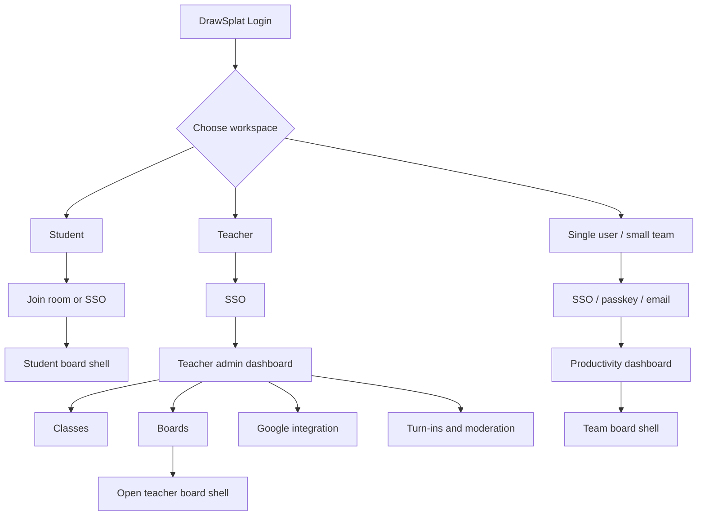

# Standalone Multi-User Architecture Plan

This document turns the standalone roadmap into an implementation plan. The current DrawSplat build is a static browser app with optional Google Apps Script storage. That is useful for lightweight classroom use, but a true multi-user product needs server-side identity, permissions, realtime collaboration, durable storage, and a teacher/admin surface that students never load.

The current static build now uses `index.html` as the public landing page and `whiteboard.html` as the English whiteboard app. The landing page explains the split between the Whiteboard and Teacher Admin. `admin.html` moves Google Apps Script setup, storage-mode choice, and classroom link generation out of the board Options dialog while keeping the existing localStorage compatibility that the board uses for Save to Google and Cloud Sync.

## Product Targets

DrawSplat should support three clear entry paths:

- **Student classroom board**: students join a teacher-created room, authenticate through school SSO or a class join link, and work only with approved board tools and student-layer permissions.
- **Teacher/admin workspace**: teachers manage classes, boards, rosters, templates, Google integrations, moderation, turn-ins, exports, and room settings away from the active student board.
- **Adult/small-team workspace**: individual users and small adult teams use DrawSplat as a productivity whiteboard without classroom language by default.

The current front-end hiding of `.teacher-only` controls is still useful for clarity, but standalone DrawSplat must treat it as presentation only. The backend must enforce every role, object-layer, admin, and integration permission.

## Recommended Application Shape

### Frontend

Keep the current SVG board renderer and object model, but split the single `app.js` file into modules during the standalone migration:

- `state/board-store`: local board state, panel state, selected objects, undo/redo.
- `state/operations`: object-level operations such as create, update, delete, reorder, lock, unlock, group, ungroup, panel add/delete/rename.
- `render/svg-renderer`: board SVG rendering, selection boxes, cursors, image/crop handling.
- `tools`: pen, eraser, text, sticky, shapes, connectors, dot pictures, image tools, diagrams, word clouds, GIF/collage tools.
- `collaboration/client`: websocket connection, operation send/receive, presence, cursors, reconnect.
- `auth/session`: current user, role, workspace, class, organization, auth status.
- `admin`: teacher and organization settings, Google integration setup, class/roster management.
- `ui/shells`: split login, student board shell, teacher admin shell, adult team shell.

The board page should consume permissions from the server and render allowed tools. It should not contain Google provider configuration UI.

### Backend

Use a normal app backend instead of Apps Script as the source of truth:

- Node.js/TypeScript with Fastify, Hono, Express, NestJS, or another familiar framework.
- PostgreSQL for relational data: users, orgs, classes, boards, panels, objects, sessions, submissions, audit logs.
- Object storage for large data: images, audio, exported PNG/PDF, board thumbnails.
- Redis or Postgres LISTEN/NOTIFY for websocket fan-out at small scale; a message broker can come later if needed.
- OpenID Connect for SSO: Google Workspace, Microsoft Entra ID, Clever/ClassLink later if school deployment demands it.

Apps Script can remain as an optional export/integration provider, but should no longer be the collaboration authority.

## Split Login Flow

### Landing Choice

The first screen should be a split role/workspace chooser:

- **I am a student**
  - Join with class link, room code, or SSO.
  - Lands directly on the active board.
  - No Google setup, roster tools, exports, or integration settings.
- **I am a teacher**
  - SSO with Google/Microsoft.
  - Lands in teacher dashboard.
  - Can open boards, create rooms, manage rosters, configure Google, review turn-ins.
- **I am working alone or with a small team**
  - Google/Microsoft SSO, passkey, or email login.
  - Lands in a productivity dashboard.
  - Uses adult/small-team wording, default Productivity mode, and team board sharing.

### Student Path

Student authentication should support:

- SSO when the school requires identifiable work.
- Join code with display name for lightweight sessions.
- Teacher-generated room links containing only opaque IDs, never raw Google script URLs or provider secrets.

After login, the server returns:

- user identity and role
- board ID and session ID
- allowed tools
- allowed panels
- allowed layers
- whether the student can create, move, edit, delete, or submit

### Teacher Path

Teacher login lands on `/admin` or `/teacher`:

- recent boards and classes
- create board from template
- start/stop room
- copy student join link
- manage room password/join code
- configure Google integration
- view turn-ins
- moderate comments and locked objects
- export board, panel, class set, or student submissions

Teacher may open the active board, but admin settings should remain in the admin shell.

### Adult/Small-Team Path

Adult users should see:

- recent boards
- team spaces
- invite/share controls
- board templates oriented around planning, diagrams, meetings, notes
- no class/student/turn-in language unless Education mode is enabled

This should map to the same backend primitives as education, but with different defaults and labels.

## Teacher Admin vs Student Board

Move these controls out of the board-facing UI and into admin:

- Google Script URL / Google provider setup
- Drive/Sheets folder selection
- class roster import
- room creation and passwords
- template gallery management
- moderation dashboard
- turn-in review
- board reset/delete
- export batches
- permission presets
- audit logs

Keep these in the board UI for teachers:

- drawing/creation tools
- panel navigation
- lock/unlock selected item
- answer-key mark/unmark
- teacher/student/shared layer selector
- quick share/status indicator

Keep these in the board UI for students:

- approved creation tools
- panel navigation if allowed
- submit turn-in/status
- collaborator cursors/presence
- read-only teacher prompts/backgrounds

## Realtime Collaboration Model

The current cloud sync saves whole board JSON on a polling interval. Standalone collaboration should move to operation-based realtime updates.

Recommended operation envelope:

```json
{
  "opId": "01H...",
  "boardId": "board_123",
  "panelId": "panel_456",
  "actorId": "user_789",
  "role": "student",
  "type": "object:update",
  "targetId": "obj_abc",
  "patch": {
    "x": 120,
    "y": 80,
    "w": 320,
    "h": 180
  },
  "clientTs": "2026-05-16T15:00:00.000Z"
}
```

Initial operations to support:

- `board:load`
- `panel:create`
- `panel:update`
- `panel:delete`
- `panel:reorder`
- `object:create`
- `object:update`
- `object:delete`
- `object:reorder`
- `object:group`
- `object:ungroup`
- `object:lock`
- `object:unlock`
- `presence:cursor`
- `presence:join`
- `presence:leave`
- `submission:create`

Server rules:

- Validate every operation against the authenticated user and board permission set.
- Reject student writes to teacher-layer objects.
- Reject panel deletion, background changes, and room settings from students.
- Assign server sequence numbers so all clients apply operations in the same order.
- Store accepted operations for audit and replay.
- Periodically compact operations into panel snapshots for fast board loads.

Conflict handling can begin with server-ordered last-write-wins at object-property level. For a classroom whiteboard, this is simpler and more predictable than a full CRDT. If offline editing becomes a requirement, add per-object revision numbers and later consider CRDT records for text-heavy objects.

## Data Model

Suggested relational tables:

```text
organizations
  id, name, type, created_at

users
  id, organization_id, email, display_name, role, auth_provider, provider_subject, created_at

teams
  id, organization_id, name, created_by

classes
  id, organization_id, teacher_id, name, term, join_code, created_at

class_members
  class_id, user_id, role, display_name

boards
  id, organization_id, owner_id, class_id, team_id, title, workspace_type, created_at, updated_at

board_permissions
  board_id, subject_type, subject_id, role, can_view, can_edit, can_admin

panels
  id, board_id, sort_order, name, background_type, background_media_id, created_at, updated_at

objects
  id, board_id, panel_id, type, layer, locked, owner_id, data_json, created_at, updated_at, deleted_at

operations
  id, board_id, panel_id, actor_id, sequence, type, target_id, payload_json, created_at

sessions
  id, board_id, user_id, role, connected_at, last_seen_at

submissions
  id, board_id, class_id, student_id, snapshot_json, thumbnail_media_id, status, created_at

media
  id, owner_id, organization_id, mime_type, byte_size, storage_key, sha256, created_at

integrations
  id, organization_id, provider, config_json_encrypted, created_by, created_at, updated_at

audit_events
  id, organization_id, actor_id, event_type, target_type, target_id, payload_json, created_at
```

Keep object payloads flexible in `data_json` so current DrawSplat object fields can move over without a large migration:

- geometry: `x`, `y`, `w`, `h`
- style: `stroke`, `strokeWidth`, `fill`, `fillPattern`, `opacity`
- text: `html`, `text`, `fontSize`, `textColor`, alignment, rotation
- media refs: `src` becomes `mediaId` where possible
- teaching metadata: `layer`, `answerKey`, `locked`, `studentOwner`

## Google Integration Boundary

The current app exposes a Google Apps Script URL field in Options for teacher users. In standalone DrawSplat, replace that with an admin-only integration provider:

- Teachers connect Google Drive/Sheets from `/admin/integrations/google`.
- OAuth tokens are stored server-side and encrypted.
- Students never receive raw tokens, Apps Script URLs, Drive folder IDs, or Sheets IDs.
- The board API calls DrawSplat's backend; the backend decides whether to write to Google, local storage, or another provider.
- Integration status is shown on the board as a simple teacher-only status: connected, disconnected, sync failed.

Provider interface:

```text
StorageProvider
  saveBoardSnapshot(boardId, snapshot)
  savePanelExport(panelId, blob)
  listTemplates(orgId)
  saveTemplate(orgId, template)
  saveSubmission(submission)
  exportClassSet(classId)
```

Implementations:

- `LocalDatabaseProvider`: default standalone storage.
- `MySqlProvider`: self-hosted SQL storage for schools or districts that prefer MySQL-compatible infrastructure.
- `GoogleDriveProvider`: Drive/Sheets backed storage for districts that want Google copies.
- `FilesystemProvider`: simple self-hosted installs.

## MySQL Storage Option

MySQL can be added without removing Google Apps Script. Treat it as another backend provider behind the same board API. The browser should never connect directly to MySQL; it should call a server endpoint, and the server should validate permissions before reading or writing database rows.

Recommended shape:

```text
POST /api/drawsplat/mysql/rooms
GET /api/drawsplat/mysql/rooms/:roomId/board
PUT /api/drawsplat/mysql/rooms/:roomId/board
POST /api/drawsplat/mysql/rooms/:roomId/media
GET /api/drawsplat/mysql/templates
POST /api/drawsplat/mysql/templates
POST /api/drawsplat/mysql/turnins
GET /api/drawsplat/mysql/turnins
DELETE /api/drawsplat/mysql/sessions/:sessionId
```

Minimal MySQL tables:

- `organizations`: district, school, team, or personal workspace.
- `users`: teacher, student, admin, or adult team member identities when auth is enabled.
- `rooms`: classroom or team whiteboard rooms with role and retention settings.
- `boards`: current board metadata, owner, room, title, and version.
- `board_snapshots`: serialized board JSON for restore points and autosave.
- `media_assets`: image/audio metadata with file/object-storage pointers.
- `templates`: reusable teacher or organization templates.
- `turnins`: student submissions and review status.
- `audit_events`: admin and retention actions, especially deletes and exports.

Retention:

- Store `expires_at` on rooms, sessions, snapshots, media, and turn-ins when they are temporary.
- Run a scheduled cleanup job that deletes expired rows and associated media files.
- Map the whiteboard Reset button to a backend delete request when a room is server-backed.
- Keep Google export optional by writing to both MySQL and `GoogleDriveProvider` only when the teacher or organization enables it.

## Temporary Session Storage

Browser-only timed sessions are available in the static build by using localStorage/IndexedDB with an expiration timestamp. This is enough for a single browser profile or shared device, but it is not cross-device storage.

Standalone folder storage requires a backend because browser JavaScript cannot write files into a server sub-folder on a static host. A minimal folder-backed provider should expose:

```text
POST /api/drawsplat/session
  creates a session and returns sessionId, expiresAt

PUT /api/drawsplat/session/:sessionId/board
  stores board JSON

GET /api/drawsplat/session/:sessionId/board
  returns board JSON if not expired

POST /api/drawsplat/session/:sessionId/media
  stores uploaded images/audio

DELETE /api/drawsplat/session/:sessionId
  clears board JSON and media immediately
```

Server behavior:

- Generate unguessable session IDs.
- Store each session in its own folder, such as `storage/sessions/<sessionId>/`.
- Write board JSON atomically, for example `board.tmp` then rename to `board.json`.
- Reject files outside the session folder; never trust client-supplied paths.
- Enforce byte limits on JSON and media.
- Run a scheduled cleanup job that deletes expired session folders.
- Treat the board reset button as a client request to delete the server session when this backend exists.

## Migration Phases

### Phase 1: Extract boundaries without changing behavior

- Move board serialization, migration, and object operations into separate modules.
- Add an operation layer locally, even before adding a server.
- Keep static hosting and Apps Script working.
- Add tests for migration, permission checks, and object operations.

### Phase 2: Add standalone backend

- Add auth, users, boards, panels, objects, media, and snapshots.
- Add REST endpoints for board load/save and media upload.
- Keep Apps Script as optional legacy export.
- Add teacher/admin route shell.

### Phase 3: Add realtime rooms

- Add WebSocket server.
- Send object-level operations.
- Add presence and cursors.
- Add server-side permission enforcement.
- Add operation replay and snapshot compaction.

### Phase 4: Split product shells

- Build split login screen.
- Build teacher admin dashboard.
- Build student board shell.
- Build adult/small-team dashboard.
- Remove Google setup from the board Options dialog in standalone mode.

### Phase 5: District-ready controls

- Add organization settings.
- Add SSO domain restrictions.
- Add roster import.
- Add audit logs and retention policies.
- Add export/delete controls for student data.

## Suggested API Surface

```text
POST   /auth/login
POST   /auth/logout
GET    /me

GET    /admin/classes
POST   /admin/classes
GET    /admin/classes/:classId/boards
POST   /admin/classes/:classId/roster/import

GET    /boards
POST   /boards
GET    /boards/:boardId
PATCH  /boards/:boardId
DELETE /boards/:boardId

POST   /boards/:boardId/panels
PATCH  /panels/:panelId
DELETE /panels/:panelId

POST   /boards/:boardId/operations
GET    /boards/:boardId/snapshot
GET    /boards/:boardId/operations?since=sequence

POST   /media
GET    /media/:mediaId

POST   /boards/:boardId/join
POST   /boards/:boardId/submissions
GET    /admin/boards/:boardId/submissions

GET    /admin/integrations
POST   /admin/integrations/google/connect
DELETE /admin/integrations/:integrationId

WS     /boards/:boardId/realtime
```

## First Standalone UI Sketch



## Immediate Repo-Level Next Steps

1. Keep this static build as the reference implementation.
2. Create a `src/` app structure in a future branch and move code out of `app.js` gradually.
3. Define a TypeScript `Board`, `Panel`, `BoardObject`, and `Operation` schema before writing the server.
4. Build permission checks as pure functions first, then reuse them on the backend.
5. Expand the new static `admin.html` into the real teacher dashboard once a backend exists.
6. Add automated tests before changing collaboration behavior.
